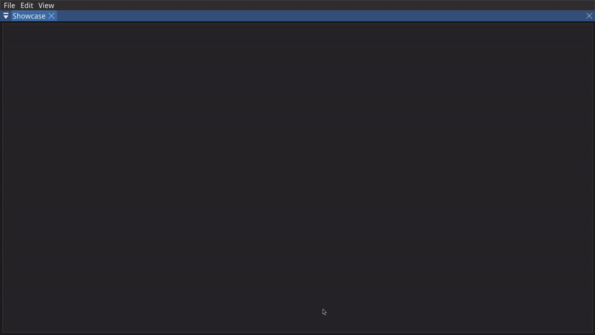
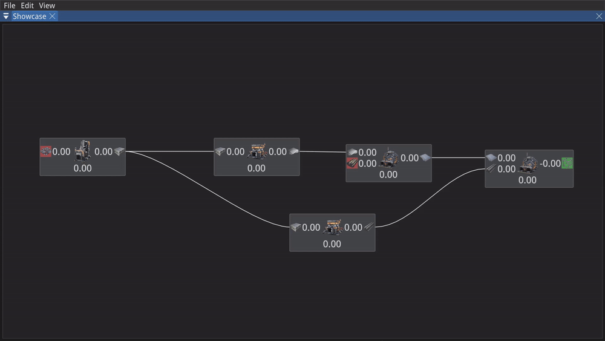
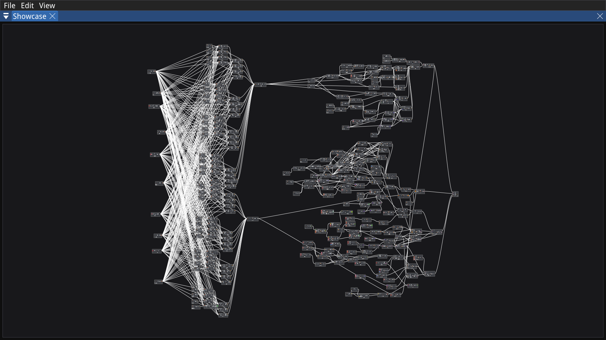
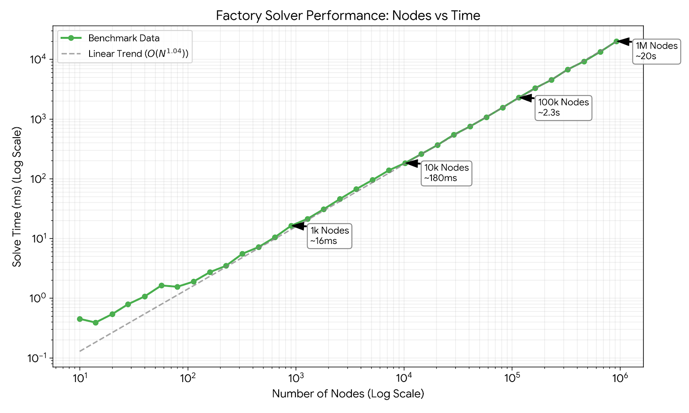

# Factory Planner

**Factory Planner** is a high-performance, node-based factory optimization tool designed to help players plan precise
production lines for factory simulation games. Built with **C++20** and **Google OR-Tools**, it calculates optimal flow
rates and machine counts using linear programming, allowing you to visualize complex production chains effortlessly.

While it currently supports only Satisfactory, the architecture is designed to be game-agnostic, with support for
additional titles planned for the future.

---

## Showcase

### Basic Factory Lines

Construct complex production chains using an intuitive node-based editor. Simply connect resources to machines and let
the solver do the math.



### Flexible Constraints

You have full control over the flow. Add constraints to any point in the graph: define specific input rates, force a
certain output amount, or bottleneck a middle stage to see how the factory adapts.



### Multi-Window & Multi-Project Workflow

Work on different parts of your factory simultaneously. Open multiple project windows, drag them side-by-side, and
copy-paste entire node groups between projects (provided they share the same game context).


### High Performance

Optimized for scale. The application handles large graphs with ease:

* **Rendering:** Smooth 60FPS+ with <300 nodes on screen.
* **Calculation:**
    * **Small/Medium (1k nodes):** Solves instantly (Real-time).
    * **Large (10k nodes):** Solves in under 200ms (Interactive).
    * **Mega-factories (100k+ nodes):** Linear scaling ensures these are solvable, though they require a few seconds of
      processing time.



---

## Technologies Used

This project is built using modern C++ standards and industry-proven libraries:

* **Core:** [C++20](https://en.cppreference.com/w/cpp/20)
* **Build System:** [CMake](https://cmake.org/) (3.30+)
* **Optimization Solver:** [Google OR-Tools](https://github.com/google/or-tools) (Linear Programming)
* **GUI & Rendering:**
* [ImGui](https://github.com/ocornut/imgui) (User Interface)
* [ImGui Node Editor](https://github.com/thedmd/imgui-node-editor) (Graph interaction)
* [GLFW](https://www.glfw.org/) & [OpenGL](https://www.opengl.org/) (Windowing & Graphics)


* **Utilities:**
* [Abseil](https://abseil.io/) (logging)
* [nlohmann/json](https://github.com/nlohmann/json) (Data serialization)
* [Native File Dialog Extended](https://github.com/btzy/nativefiledialog-extended) (Cross-platform file dialogs)
* [GoogleTest](https://github.com/google/googletest) (Unit testing)
* [Quadtree](https://github.com/pvigier/Quadtree) (Spatial partitioning for performance)

### **Solver Performance**

Optimized for scale. The application uses a custom linear solver implementation that demonstrates **linear
scaling ($O(N)$)**. While massive factories will naturally take time to compute, the solver avoids exponential
slowdowns, making it predictable and stable even at extreme scales.

#### **Benchmark Results:**



---

## Building

### Prerequisites

* A C++20 compatible compiler (MSVC, GCC, or Clang)
* Git
* CMake 3.30 or higher
* Google OR-Tools installed (or available via package manager)

### Windows

* Make sure you have Visual Studio Build Tools installed.

#### 1. Clone the repository:

```bash
git clone https://github.com/Hagoel-git/factory-planner
cd factory-planner
git checkout dev
```

> you must checkout the `dev` branch as the `main` branch is not up to date.

#### 2. Initialize submodules:

```bash
git submodule update --init --recursive
```

#### 3. Setup OR-Tools:

1. Download the Visual Studio 2022 binary (v9.10+) from
   the [OR-Tools releases page](https://github.com/google/or-tools/releases)
    * Look for: `or-tools_x64_VisualStudio2022_cpp_v9.14.6206.zip `
2. Extract the downloaded archive.
3. *Rename* the extracted folder to `or-tools`.
4. Move the `or-tools` folder into the `external/` directory of the factory-planner repository. (e.g.,
   `factory-planner/external/or-tools`)

#### 4. Use the "Native Tools Command Prompt"

Open the "x64 Native Tools Command Prompt for VS" (search for it in the Start Menu) and run:

```bash
cd path\to\factory-planner
```

#### 5. Create a build directory and navigate into it:

```bash
mkdir build
cd build
```

#### 6. Run CMake to configure the project:

```bash
cmake -G "NMake Makefiles" -DCMAKE_BUILD_TYPE=Release -DCMAKE_PREFIX_PATH="%cd%\..\external\or-tools" -Dortools_DIR="%cd%\..\external\or-tools\lib\cmake\ortools" ..
```

#### 7. Build the project:

```bash
cmake --build .
```

#### 8. Run the application:

```bash
.\bin\factory_planner.exe
```

### Linux

#### 1. Clone the repository:

```bash
git clone https://github.com/Hagoel-git/factory-planner
cd factory-planner
git checkout dev
```

> you must checkout the `dev` branch as the `main` branch is not up to date.

#### 2. Initialize submodules:

```bash
git submodule update --init --recursive
```

#### 3. Setup OR-Tools:

1. Go to the [OR-Tools releases page](https://github.com/google/or-tools/releases)
2. Download the C++ binary archive that matches your Linux distribution (e.g.,
   `or-tools_amd64_archlinux_cpp_v9.14.6206.tar.gz`).
3. Extract the downloaded archive.
4. *Rename* the extracted folder to `or-tools`.
5. Move the `or-tools` folder into the `external/` directory of the factory-planner repository. (e.g.,
   `factory-planner/external/or-tools`)

#### 4. Create a build directory and navigate into it:

```bash
mkdir build
cd build
```

#### 5. Run CMake to configure the project:

```bash
cmake .. -DCMAKE_BUILD_TYPE=Release -DCMAKE_PREFIX_PATH="$(pwd)/../external/or-tools" -Dortools_DIR="$(pwd)/../external/or-tools/lib/cmake/ortools"
```

#### 6. Build the project:

```bash
cmake --build .
```

#### 7. Run the application:

```bash
./bin/factory_planner
```

---

## License

Distributed under the GNU General Public License v3.0. See `LICENSE` for more information.

